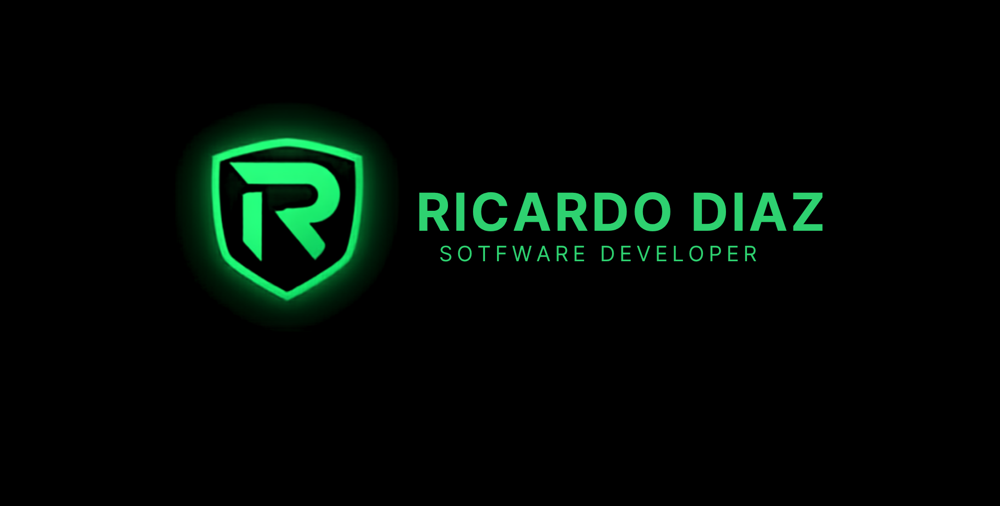
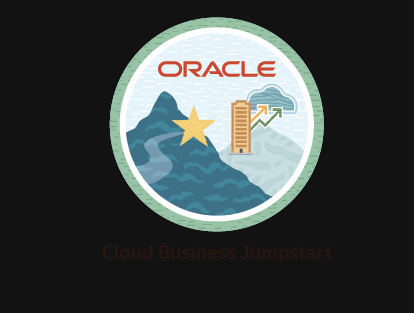
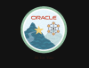

<h1 align="center">Hi, I am Ricardo Diaz </h1>

    

 

## <picture></picture>About me

<picture> </picture>

 

💻 Desarrollador Full Stack con dos años de experiencia en el sector tecnológico, donde he enfrentado desafíos que
fortalecieron mi capacidad de adaptación y resiliencia. Me especializo en diseño web y en la construcción de soluciones
que optimizan procesos empresariales. Autodidacta por convicción, nunca dejo de aprender y busco crecer profesionalmente aportando valor en cada equipo de trabajo.
 

 

## <picture> </picture>Connect with me
 

    
    
    
        

 

## 🛠️ My Skills

 

### <picture>  </picture> Programming languages

  

 

### <picture> </picture>Frontend Development

    
    

 

### <picture> </picture> Software & Tools

  

 

### <picture> </picture>IDEs

    

 

### <picture>  </picture>Databases

 

### <picture>  </picture>Operating Systems
 

 

##

    <a href="https://github.com/piyushsuthar/github-readme-quotes"> 

 

## <picture> </picture> Github Stats
 

  

 

## Where I have studied

 

## Most recent courses taken

  

## 🐍 A Snake Eating my Contributions Graph

    

